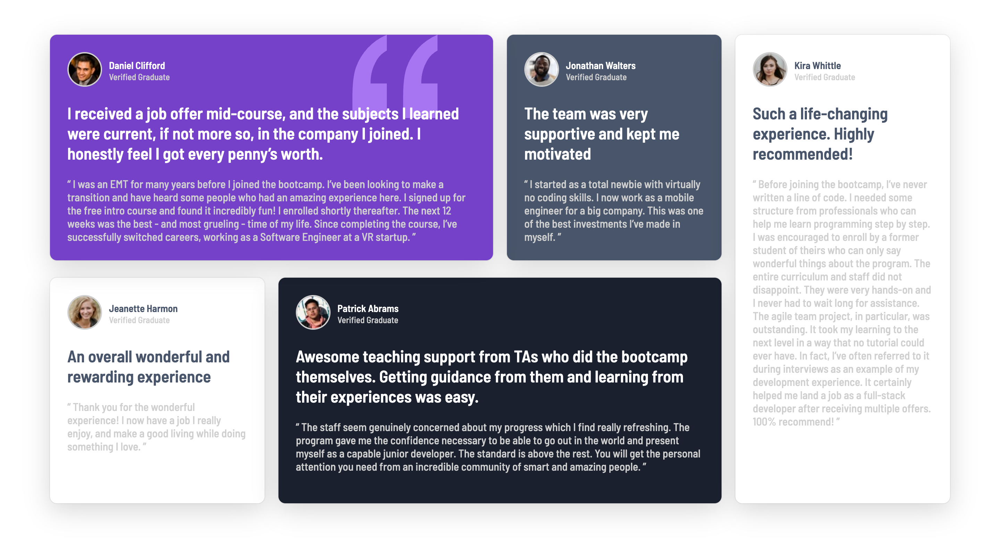
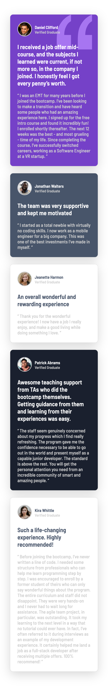

# Frontend Mentor - Testimonials grid section solution

This is a solution to the [Testimonials grid section challenge on Frontend Mentor](https://www.frontendmentor.io/challenges/testimonials-grid-section-Nnw6J7Un7). Frontend Mentor challenges help you improve your coding skills by building realistic projects. 

## Table of contents

- [Overview](#overview)
  - [The challenge](#the-challenge)
  - [Screenshot](#screenshot)
  - [Links](#links)
- [My process](#my-process)
  - [Built with](#built-with)
  - [What I learned](#what-i-learned)
  - [Continued development](#continued-development)
- [Author](#author)


## Overview

### The challenge

Users should be able to:

- View the optimal layout for the site depending on their device's screen size

### Screenshot

- Desktop view


- Mobile view

  


### Links

- Solution URL: [GitHub](https://github.com/EshrakRahman/Frontend-Mentor---Testimonials-grid-section)
- Live Site URL: [GitHub page](https://eshrakrahman.github.io/Frontend-Mentor---Testimonials-grid-section/)

## My process

### Built with

- Semantic HTML5 markup
- CSS custom properties
- Flexbox
- CSS Grid
- Mobile-first workflow

### What I learned

I recently completed a newbie challenge on FrontendMasters, diving deep into the world of CSS Flexbox. Before this, positioning items in dynamic layouts felt complex. Flexbox, however, transformed my approach, offering a streamlined method to align and distribute elements within a container. Through properties like justify-content, align-items, and flex-direction, I mastered the art of creating responsive and visually appealing designs. This wasn't just about grasping a theoretical concept; it was hands-on learning, giving me the confidence to tackle modern web design challenges with a fresh perspective.

To see how you can add code snippets, see below:

```html
  <div class="grid-container">
  <div class="cards daniel">
    
    <div class="cards-details">
      <div class="profile-info">
        <div class="img-wrapper">
          
        </div>
        <div class="name-designation">
          <p>Daniel Clifford</p>
          <p>Verified Graduate</p>
        </div>
      </div>
      <div class="review">
        <p class="short-intro">
          I received a job offer mid-course, and the subjects I learned were current, if not more so,
          in the company I joined. I honestly feel I got every penny’s worth.
        </p>
        <p class="full-review">
          “ I was an EMT for many years before I joined the bootcamp. I’ve been looking to make a
          transition and have heard some people who had an amazing experience here. I signed up
          for the free intro course and found it incredibly fun! I enrolled shortly thereafter.
          The next 12 weeks was the best - and most grueling - time of my life. Since completing
          the course, I’ve successfully switched careers, working as a Software Engineer at a VR startup. ”
        </p>
      </div>
    </div>
  </div>
  <div class="cards jonathan">
    <div class="cards-details">
      <div class="profile-info">
        <div class="img-wrapper">
          
        </div>
        <div class="name-designation">
          <p>Jonathan Walters</p>
          <p>Verified Graduate</p>
        </div>
      </div>
      <div class="review">
        <p class="short-intro">
          The team was very supportive and kept me motivated
        </p>
        <p class="full-review">
          “ I started as a total newbie with virtually no coding skills. I now work as a mobile engineer
          for a big company. This was one of the best investments I’ve made in myself. ”
        </p>
      </div>
    </div>
  </div>
  <div class="cards jeanette">
    <div class="cards-details">
      <div class="profile-info">
        <div class="img-wrapper">
          
        </div>
        <div class="name-designation">
          <p>Jeanette Harmon</p>
          <p>Verified Graduate</p>
        </div>
      </div>
      <div class="review">
        <p class="short-intro">
          An overall wonderful and rewarding experience
        </p>
        <p class="full-review">
          “ Thank you for the wonderful experience! I now have a job I really enjoy, and make a good living
          while doing something I love. ”
        </p>
      </div>
    </div>
  </div>
  <div class="cards patrick">
    <div class="cards-details">
      <div class="profile-info">
        <div class="img-wrapper">
          
        </div>
        <div class="name-designation">
          <p>Patrick Abrams</p>
          <p>Verified Graduate</p>
        </div>
      </div>
      <div class="review">
        <p class="short-intro">
          Awesome teaching support from TAs who did the bootcamp themselves. Getting guidance from them and
          learning from their experiences was easy.
        </p>
        <p class="full-review">
          “ The staff seem genuinely concerned about my progress which I find really refreshing. The program
          gave me the confidence necessary to be able to go out in the world and present myself as a capable
          junior developer. The standard is above the rest. You will get the personal attention you need from
          an incredible community of smart and amazing people. ”
        </p>
      </div>
    </div>
  </div>
  <div class="cards kira">
    <div class="cards-details">
      <div class="profile-info">
        <div class="img-wrapper">
          
        </div>
        <div class="name-designation">
          <p>Kira Whittle</p>
          <p>Verified Graduate</p>
        </div>
      </div>
      <div class="review">
        <p class="short-intro">
          Such a life-changing experience. Highly recommended!
        </p>
        <p class="full-review">
          “ Before joining the bootcamp, I’ve never written a line of code. I needed some structure from
          professionals who can help me learn programming step by step. I was encouraged to enroll by a former
          student of theirs who can only say wonderful things about the program. The entire curriculum and staff
          did not disappoint. They were very hands-on and I never had to wait long for assistance. The agile team
          project, in particular, was outstanding. It took my learning to the next level in a way that no tutorial
          could ever have. In fact, I’ve often referred to it during interviews as an example of my development
          experience. It certainly helped me land a job as a full-stack developer after receiving multiple offers.
          100% recommend! ”
        </p>
      </div>
    </div>
  </div>
</div>
```
```css
.cards-details .profile-info .name-designation p:first-child {
  font-size: .9rem;
  font-weight: 700;
  color: var(--primary-white);
}

.cards-details .profile-info .name-designation p:last-child {
  font-size: .8rem;
  font-weight: 500;
  color: var(--light-gray);
}

.cards-details .review .short-intro {
  width: 98%;
  font-size: 1.3rem;
  font-weight: 700;
  color: var(--primary-white);
  margin-bottom: 20px;
}
```


### Continued development

Having tackled FrontendMasters' challenge, I delved into CSS Flexbox, streamlining complex layouts with newfound mastery. Using pivotal properties, I now confidently craft responsive designs, a testament to my hands-on growth in modern web design. My continuous development highlights my resilience and adaptabilit

## Author

- Website - [GitHub](https://www.github.com/eshrakrahman)
- Frontend Mentor - [@eshrakrahman](https://www.frontendmentor.io/profile/eshrakrahman)
- Twitter - [@rahman_eshrak](https://www.twitter.com/rahman_eshrak)
